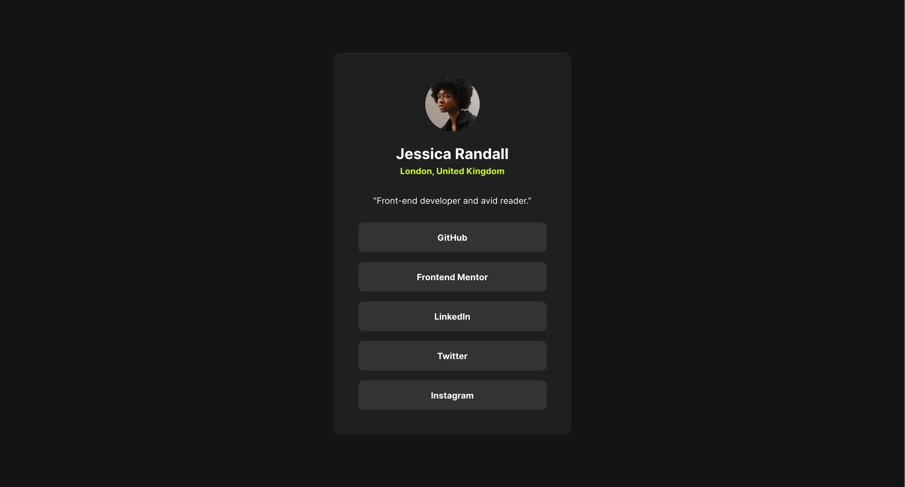
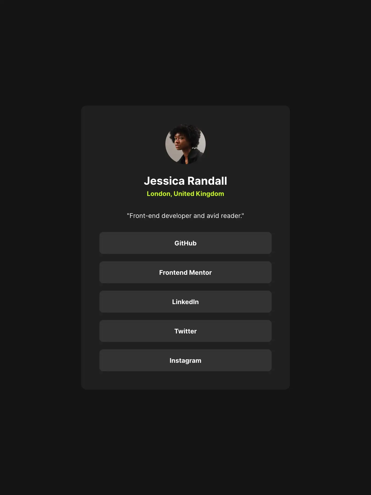
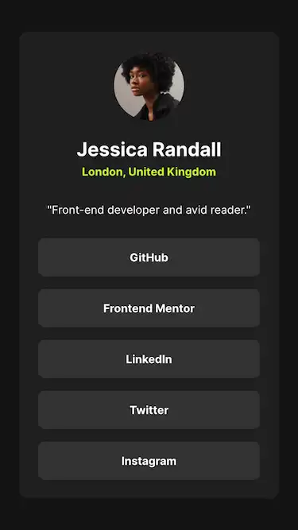

# Frontend Mentor - Social links profile solution

This is a solution to the [Social links profile challenge on Frontend Mentor](https://www.frontendmentor.io/challenges/social-links-profile-UG32l9m6dQ). Frontend Mentor challenges help you improve your coding skills by building realistic projects.

## Table of contents

- [Overview](#overview)
  - [The challenge](#the-challenge)
  - [Screenshot](#screenshot)
  - [Links](#links)
- [My process](#my-process)
  - [Built with](#built-with)
  - [What I learned](#what-i-learned)
- [Author](#author)

## Overview

### The challenge

Users should be able to:

- See hover and focus states for all interactive elements on the page

### Screenshot

Desktop view:

Tablet view:

Mobile view:

### Links

- Solution URL: [You're already here.](https://github.com/kalwilson/fem-social-links-profile)
- Live Site: [Click here!](https://kalwilson.github.io/fem-social-links-profile/)

## My process

### Built with

- Semantic HTML5 markup
- CSS custom properties
- Flexbox
- Mobile-first workflow

### What I learned

- How to navigate through the Figma desktop app and dev mode

## Author

- GitHub - [Kal Wilson](https://github.com/kalwilson)
- Frontend Mentor - [@kalwilson](https://www.frontendmentor.io/profile/kalwilson)
- LinkedIn - [Kal Wilson](https://www.linkedin.com/in/kalwilson)
